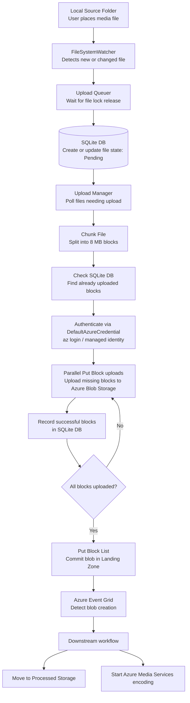

### Architecture



1. **Local Source Folder:** The user puts a media file here.
2. **FileSystemWatcher:** The active agent detects a new or changed file.
3. **Upload Queuer & Local DB:** The event is queued. It waits for the file lock to release (debouncing), then records the file path and initializes the `Pending` state in a local **SQLite DB**.
4. **Upload Manager:** The core process. It checks the DB for files needing attention.
5. **Chunking & State Check:** For a new file, it divides it into blocks (default 8 MB). The Upload Manager queries the SQLite DB to find which blocks have already been uploaded successfully.
6. **Authentication:** The service uses `DefaultAzureCredential` from the Azure Identity SDK. On a personal laptop this picks up your `az login` session; on an Azure VM it can use a managed identity.
7. **Put Block (Parallel):** The chunker reads the appropriate bytes, and the Upload Manager initiates multiple concurrent uploads to stage individual blocks directly to Azure Blob Storage.
8. **Put Block List (Commit):** Once all blocks for a file are confirmed successful in the SQLite DB, the Upload Manager makes a final `Put Block List` call to Azure, finalizing the complete media file in the **Landing Zone**.
9. **Post-Processing:** Azure Event Grid detects the new blob creation and automatically triggers a downstream workflow, such as moving the file to **Processed Storage** or starting an **Azure Media Services** encoding job.

## Production Setup

### 1. Prerequisites

- Python 3.12+
- [uv](https://docs.astral.sh/uv/) package manager
- Azure CLI (`az`) installed and logged in

### 2. Azure Setup

Create a storage container:

```bash
az storage container create \
  --account-name <your-account> \
  --name landing-zone \
  --auth-mode login
```

Grant the **Storage Blob Data Contributor** role to your identity:

```bash
az role assignment create \
  --assignee $(az ad signed-in-user show --query id -o tsv) \
  --role "Storage Blob Data Contributor" \
  --scope /subscriptions/<sub-id>/resourceGroups/<rg>/providers/Microsoft.Storage/storageAccounts/<your-account>
```

Log in so `DefaultAzureCredential` can authenticate:

```bash
az login
```

### 3. Configuration

Edit `config.yaml`:

```yaml
watch_dir: /path/to/your/watch/folder
storage_account_url: https://<your-account>.blob.core.windows.net
container_name: landing-zone
db_path: /path/to/blob_sync.db
```

All settings can also be provided via environment variables: `WATCH_DIR`, `STORAGE_ACCOUNT_URL`, `CONTAINER_NAME`, `DB_PATH`, `BLOCK_SIZE_BYTES`, `MAX_PARALLEL_UPLOADS`, `POLL_INTERVAL_SECONDS`, `DEBOUNCE_SECONDS`.

### 4. Run

```bash
uv run python -m blob_sync_service
```

Stop with `Ctrl+C` or:

```bash
kill $(pgrep -f "blob_sync_service")
```

### 5. Run as a systemd Service (optional)

The service unit file is at `systemd/blob-sync.service`.

```bash
sudo cp systemd/blob-sync.service /etc/systemd/system/
sudo systemctl daemon-reload
sudo systemctl enable --now blob-sync
journalctl -u blob-sync.service -f
```

Create `/etc/blob-sync/env` with any environment overrides. Adjust `ExecStart` in the unit file to point at your installation.

> **Note:** When running under a dedicated service user, `DefaultAzureCredential` won't find your personal `az login` session. Options:
> - Use a **managed identity** (on Azure VMs).
> - Set `AZURE_CLIENT_ID`, `AZURE_TENANT_ID`, and `AZURE_CLIENT_SECRET` in `/etc/blob-sync/env` for a service principal.
> - Run the service as your own user in the unit file.
